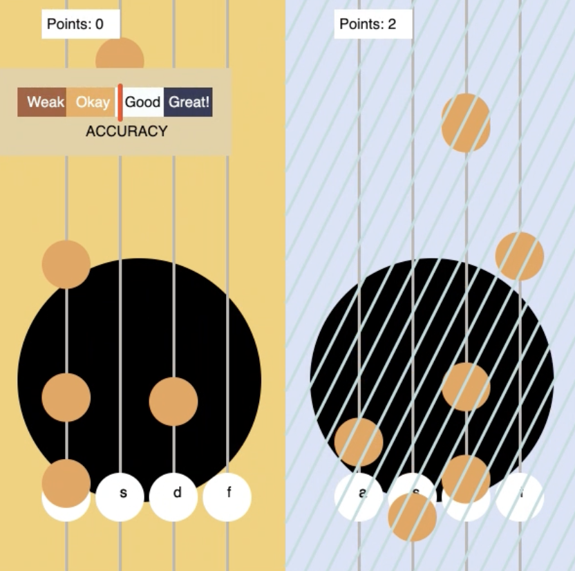

# Strike a Chord - Multiplayer Guitar Battle Game

## Introduction

Welcome to **Strike a Chord**, a multiplayer guitar battle game that lets you face off against a friend or a random player in an epic musical showdown! This project leverages JavaScript, Node.js, and real-time communication to create an electrifying gaming experience where players can challenge each other's rhythm and accuracy.

🎸🎶🧡

## Technical Details

### Architecture

Strike a Chord is designed with a client-server architecture using JavaScript and Node.js. Here's an overview of the technical components:

- **Frontend:** The game's user interface is built with HTML and JavaScript, ensuring a smooth and responsive experience for players.

- **Backend:** The server-side logic is powered by Node.js, providing real-time communication and game synchronization between players.

- **Real-time Communication:** WebSockets are employed to enable real-time gameplay synchronization. Players' actions are instantly communicated to maintain gameplay consistency.

- **Graphics and Animation:** All in-game graphics, including the guitar fretboards, notes, and UI elements, are custom-designed.

### Multiplayer Implementation

Strike a Chord's multiplayer functionality is a technical feat that enhances the gaming experience. Key technical aspects include:

- **Server-Client Communication:** WebSocket communication ensures that players' actions are transmitted between clients and the server in real time.

- **Synchronized Gameplay:** Both players experience the same set of notes and rhythms, creating a fair and competitive environment.

- **Live Scoreboard:** The server maintains a live scoreboard, updating player scores in real time, which is then displayed on the user interface.

